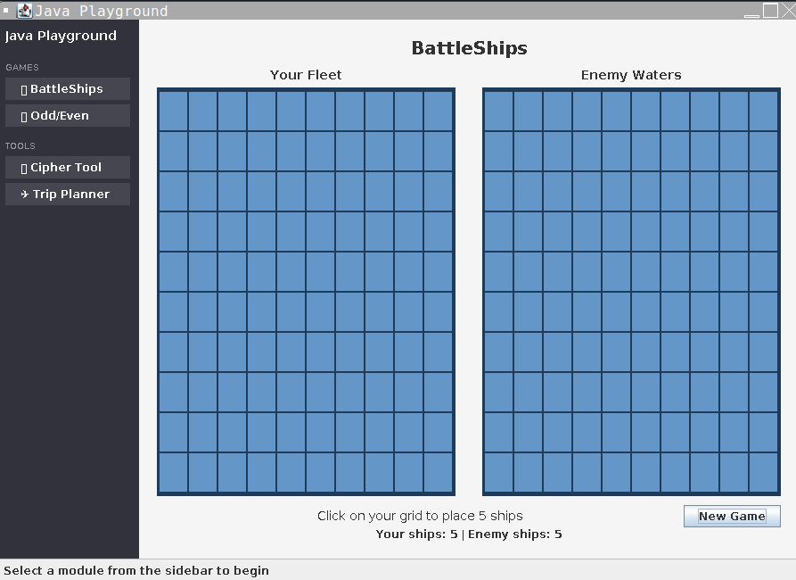

# Java Playground

A showcase of Java mini-applications (Swing GUI).


## 🎮 Run Online

[**▶️ Run on Replit**](https://replit.com/new/github/millenniumsingha/millennium_java_suite)

*Instructions:*
1. Click the link above and select **"Import"**.
2. Once the editor loads, click the big green **"Run"** button.
3. **Important:** If you see "No external ports", check the tabs above the preview window and switch to **"VNC"** to see the GUI.

## 📦 Applications Included

<table>
  <tr>
    <td width="50%" valign="top">
      <h3 align="center">1. Trip Planner</h3>
      <p align="center">Budget, Timezone & Distance Calculator</p>
      
    </td>
    <td width="50%" valign="top">
      <h3 align="center">2. BattleShips</h3>
      <p align="center">Classic Naval Strategy vs AI</p>
      
    </td>
  </tr>
  <tr>
    <td width="50%" valign="top">
      <h3 align="center">3. Cipher Tool</h3>
      <p align="center">Real-time Caesar Encryption</p>
      
    </td>
    <td width="50%" valign="top">
      <h3 align="center">4. Odd/Even</h3>
      <p align="center">Quick Odds & Evens Game</p>
      
    </td>
  </tr>
</table>

## 🛠️ Technology

- **Java Swing** - Desktop GUI framework
- **Maven** - Build automation

## 🚀 Running Locally

### Prerequisites
- Java JDK 11+
- Maven

### Build & Run
```bash
# Build JAR
mvn clean package

# Run
java -jar target/JavaShowcase-1.0.jar
```

## 📁 Project Structure

```
java-showcase/
├── src/main/java/showcase/
│   ├── App.java                 # Main entry, sidebar navigation
│   └── panels/                  # Individual app modules
├── pom.xml                      # Maven build config
└── README.md
```

## 📝 Origin

These applications started as Java coursework exercises demonstrating:
- Control flow and game logic (BattleShips, Odd/Even)
- String manipulation and algorithms (Cipher)
- Mathematical computations (Trip Planner)

Reimplemented as a unified Swing application.

## 📄 License

GNU General Public License v2.
